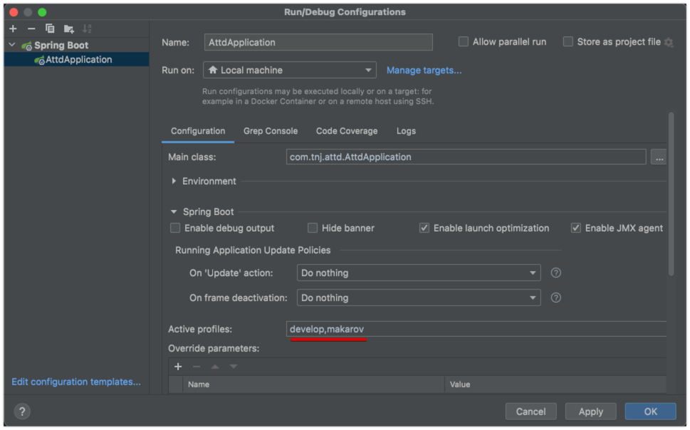

# Changelog 2021-10-28

Предлагаю рассмотреть следующие моменты по улучшению кодовой базы.

Текущий коммит предлагаю использовать как подсказку - для начала попробовать реализовать самостоятельно, а потом сравнить с коммитом и улучшить свое решение если потребуется.

Задачи по улучшению:
1. Отключить автогенерацию миграций через Hibernate и перейти на автомиграции с помощью Flyway.
2. Не использовать в проекте Date. Этот фреймворк давно не развивается и считается небезопасным. Помимо прочего у него есть проблемы с часовыми поясами и високосными секундами. Лучше перейти на более современный фреймворк от Java 8 - Instant, LocalDate, LocalDateTime, ZonedDateTime.
3. Привыкай к правильному code-style сразу, используй автоформатирование кода (Ctrl + Shift + L). 

## 1. Автомиграции

Hibernate не всегда красиво выполняет миграции.
Лучше этот процесс доверить сервису автомиграций и самому писать SQL код для миграций.
Например, это удобно при создании новых таблиц и выполнении добавления и обновления данных.
Написание своей миграции не займет много времени, зато целостность БД будет сохранена.
Это очень важно когда у тебя несколько стендов для тестов и несколько продакшенов под разных клиентов.

Для автомиграций хорошо подходит Flyway.
Он умеет вести историю миграций и не будет запускать приложение, если миграция прошла с ошибкой.
Обрати внимание как Flyway прикрепился к проекту - просто через аннотацию `@Configuration`.
В первой миграции просто создает таблицы.

## 2. Разбивка конфига на профили

Разбил конфиг под разные профили - добавил develop и makarov.
Для этого добавил файлы `application-<profile>.properties`.
Список профилей настраивается в конфигурации `Run/Debug Configurations`: 


В каждом отдельном конфиге можно перекрывать конфиги от основного файла конфига.

## 3. Правильный code-style

Когда придется работать в команде, то придется принять code-style команды.
Есть куча стандартов по code-style. Но обычно команды придерживаются общего стиля от разработчиков Java или другого ЯП.
Например, при анализе следующего кода приходится делать паузы чтобы разделить методы друг от друга:
```java
public Integer getAuthId() {return auth_id;}
public String getToken()   {return token;}
public Date getDt()        {return dt;}
```
Граздо лучше разбивать пробелами блоки (в данном примере это методы), чтобы улучшить читаемость:
```java
public Instant getAuthTime() {
    return authTime;
}

public void setDt(Instant authTime) {
    this.authTime = authTime;
}
```
Есть еще одно правило, которое позволит улучшить читаемость - операторы return и throw должны быть в отдельной строке. 
По-хорошему, все операторы лучше выводить в отдельной строке.

IDEA поддерживает по умолчанию code-style от OJM - достаточно вызвать меню `Code\Reformat Code`.
Если хочешь сформировать свой code-style в проекте, то посмотри на Java Lint, например, Checkstyle или Lightrun.
